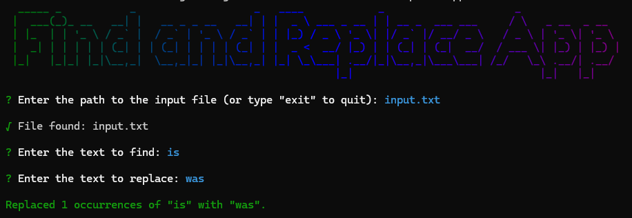

# Find and Replace App



This repository contains the code for a simple find and replace application. It is a command-line application that asks the user for an input file, a search string, and a replacement string. The application then reads the input file, finds all instances of the search string, and replaces them with the replacement string. The modified text is then written to an output file. The application is built using Node.js, Chalk, Chalk Animation, Figlet, Gradient String, Inquirer, and Nanospinner. Make sure to have the input file in the same directory as the application.

To run the application, clone the repository and type in the terminal:

```bash
npm install
```

```bash
node .
```